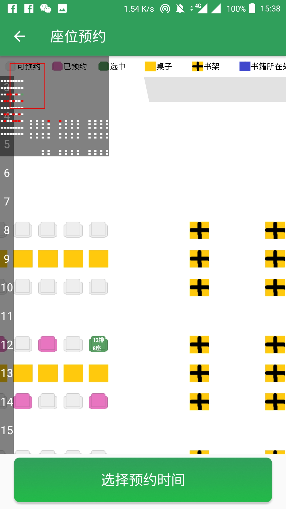
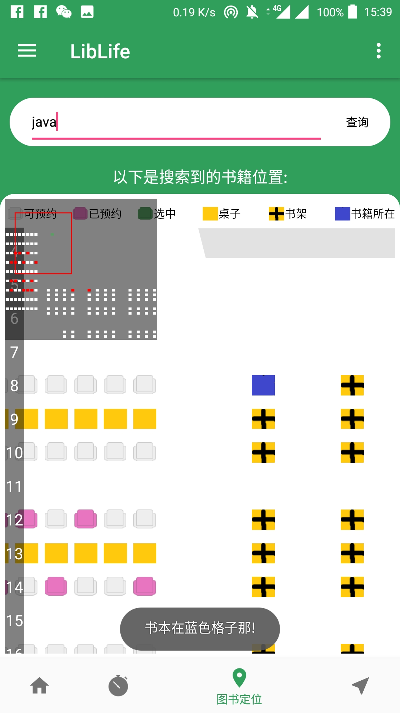

# LibLife

---

A mobile application aims to providing a NEU library service including Seat reserve, Book finder, and more Accessibility functions like PaperDeliver etc.
---
## Homepage

 

## Seat Reserve

 
 
 
 
## Book Finder

 

## Study Mode

## Extend Function - PaperDeliver

---

### Thanks for team leader CG Lee, and cooperators H Tang, XW Chen, QW Wu.

Any problem: email to 973149077@qq.com