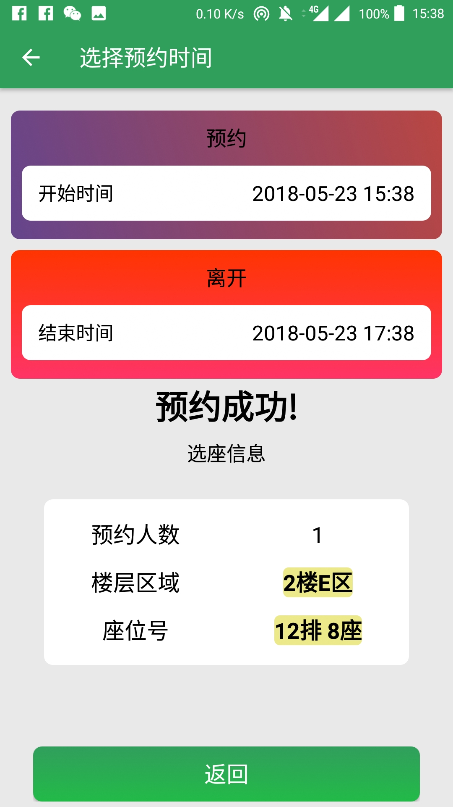
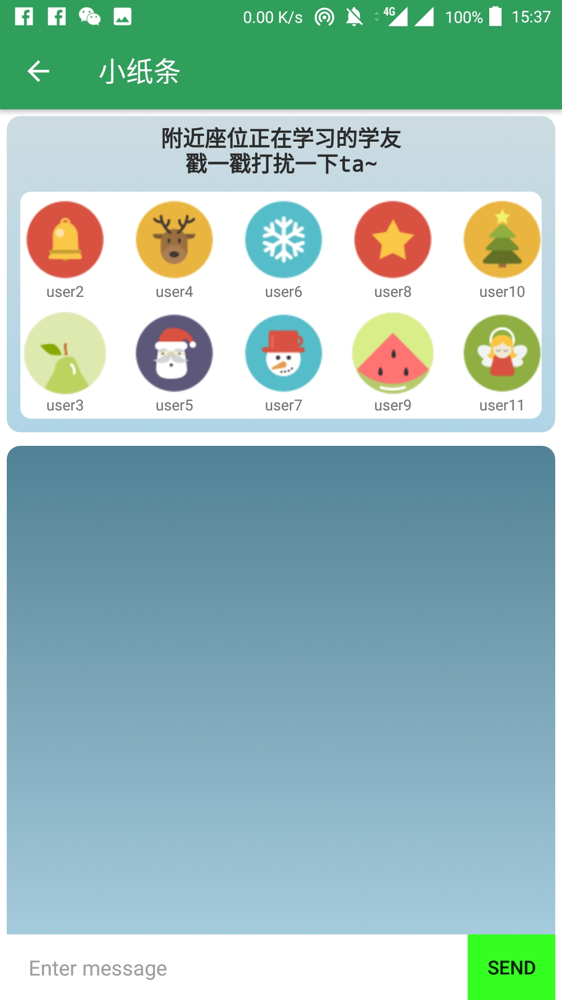
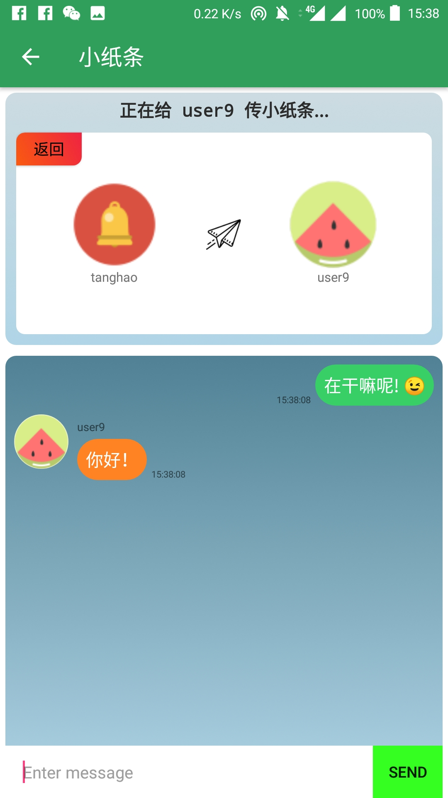

# LibLife

---

A mobile application aims to providing a NEU library service including Seat reserve, Book finder, and more Accessibility functions like PaperDeliver etc.
---
## Homepage

{:height="50%" width="50%"}

## Seat Reserve

{:height="50%" width="50%"}
{:height="50%" width="50%"}
{:height="50%" width="50%"}
## Book Finder

{:height="50%" width="50%"}

## Study Mode

{:height="50%" width="50%"}

## Extend Function - PaperDeliver

{:height="50%" width="50%"}
{:height="50%" width="50%"}

---

### Thanks for team leader CG Lee, and cooperators H Tang, XW Chen, QW Wu.

Any problem: email to 973149077@qq.com